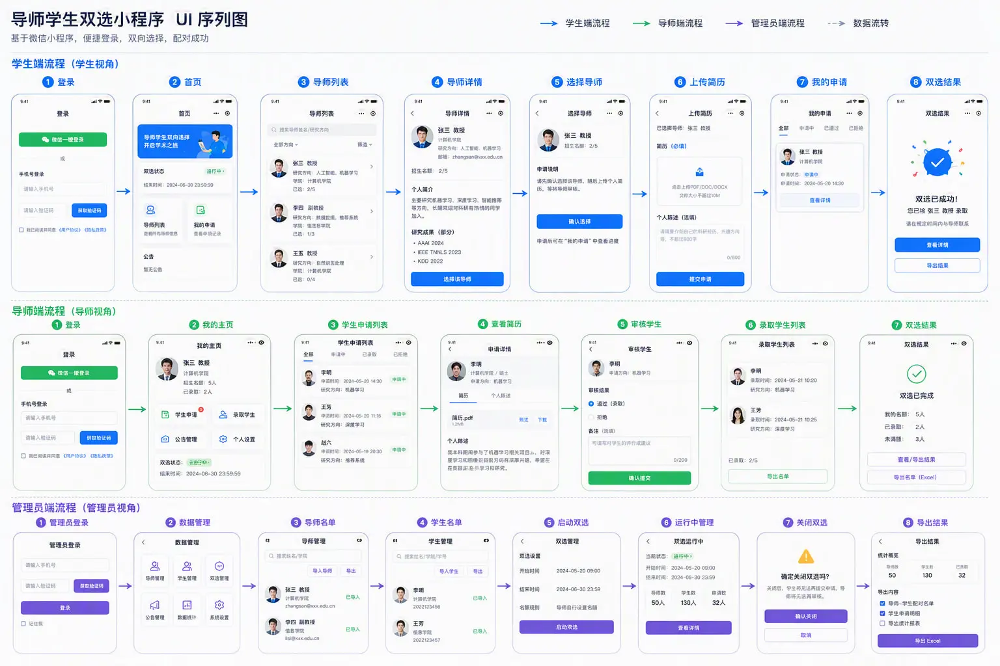
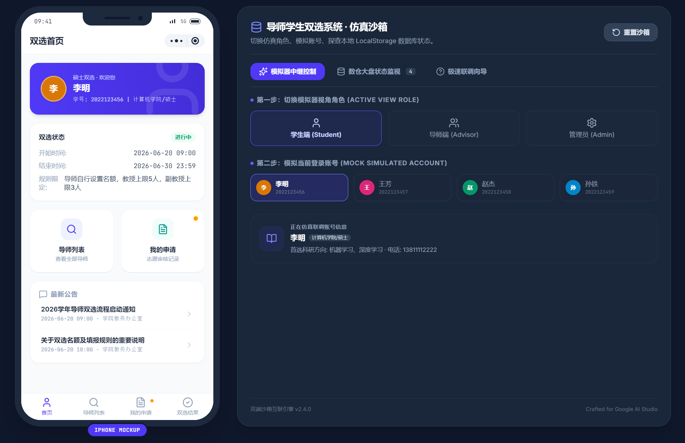
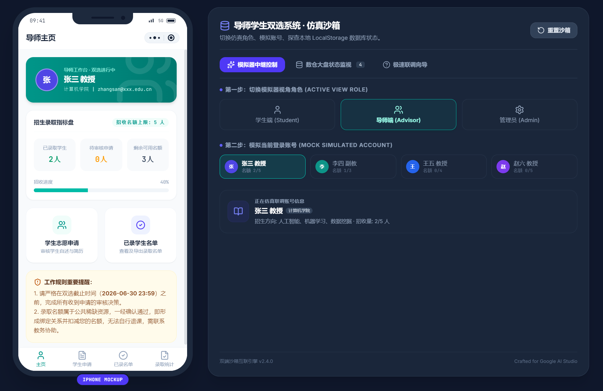
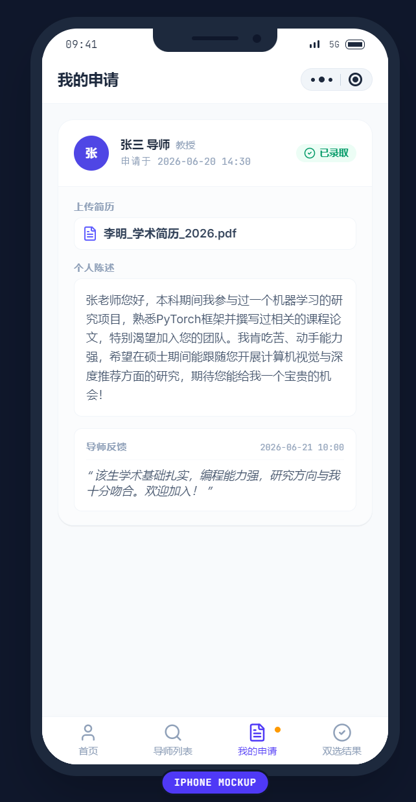
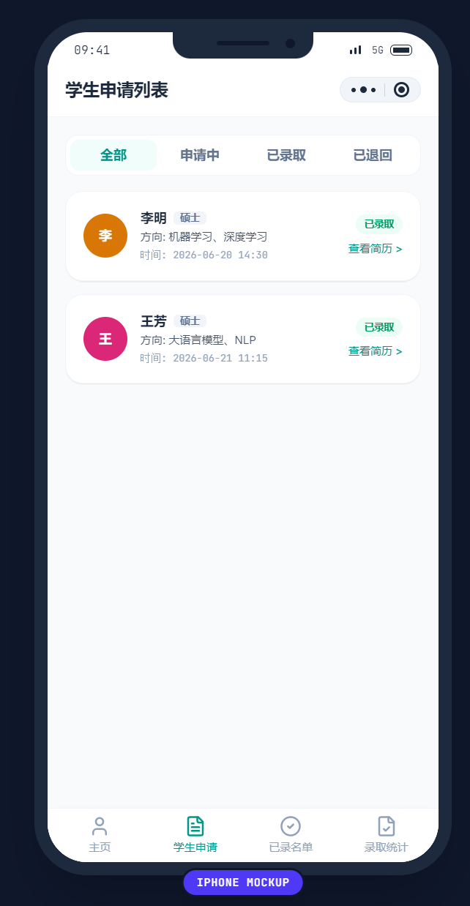
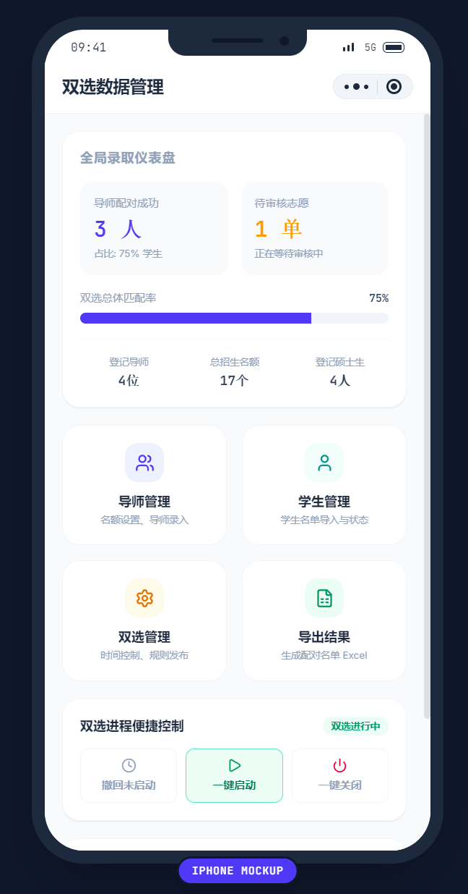
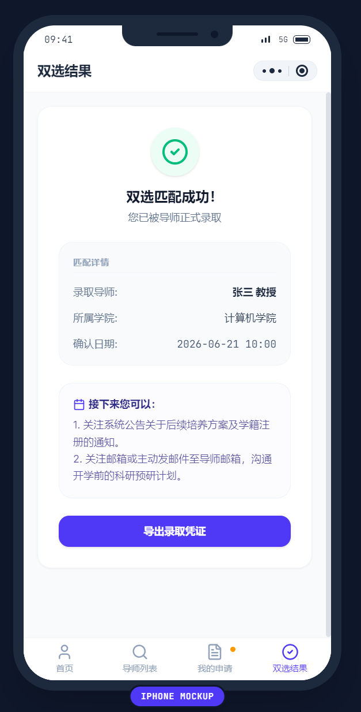

+++
date = '2026-07-18T15:42:05+08:00'
draft = false
title = 'AI从需求到原型图小实践'

categories = ['技术文章']
tags =  ["AI"]

+++

## 1、生成序列图

> 将需求截图给OpenAI image2生成的序列图 

## 2、生成原型图

> 还可以把 UI 序列图扔给 Aistudio build 直接给你原型：
> https://ai.studio/apps/e5206069-dc3e-4c6b-9b78-107cbf7d399a?fullscreenApplet=true

## 3、总结

- 针对这种传统的系统，现在只需要让 AI 自己生成 UI 图再扔给擅长原型开发的 AI 就能生成 Demo，压根没有任何人为干涉。后续一般稍微再投入一些时间去做 UI 设计和优化就能直接用了。
- 但要上线的话，个人觉得开发者还是需要了解一些基础的前后端和部署相关知识，当然这一点也完全可以通过与 AI 交流来完成。
