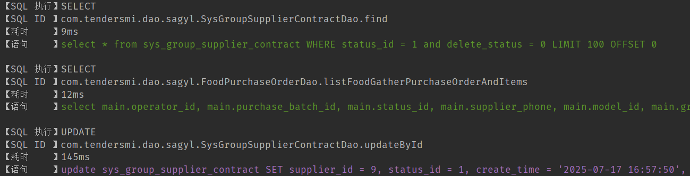

+++
date = '2025-08-13T17:07:31+08:00'
draft = false
title = 'Mybatis自定义SQL打印'
categories = ['Java']
tags =  ["Java", "Mybatis"]

+++

#### 1、目的

1. 代码着色，CRUD的SQL显示不同颜色
2. 慢查询检测，慢查询SQL黄色标记
3. 实际完整SQL控制台打印
4. 可以在配置文件配置忽略打印的表



#### 2、实现原理

>1. 创建一个类实现Interceptor接口。
>2. 在intercept方法中，获取执行的SQL信息，记录开始时间，执行方法，然后记录结束时间，计算耗时。
>3. 使用org.apache.ibatis.reflection.MetaObject和org.apache.ibatis.reflection.SystemMetaObject来获取SQL语句和参数。
>4. 将SQL和参数结合，形成可执行的完整SQL（注意：这里我们使用Mybatis提供的工具类ParameterHandler来获取参数并替换到SQL中可能比较复杂，实际上Mybatis的SQL日志打印通常是通过日志框架配置的，但这里我们通过拦截器实现）。
>5. 根据耗时决定打印颜色。
>
>具体步骤（在拦截器中）：
>- 拦截Executor的update和query方法。
>- 获取BoundSql，通过BoundSql获取SQL字符串（带占位符）和参数对象。
>- 通过BoundSql的ParameterMappings和参数对象，构建完整的SQL。

#### 3、代码实现

1. Java代码

```java
import org.apache.ibatis.executor.Executor;
import org.apache.ibatis.mapping.BoundSql;
import org.apache.ibatis.mapping.MappedStatement;
import org.apache.ibatis.mapping.ParameterMapping;
import org.apache.ibatis.plugin.*;
import org.apache.ibatis.reflection.MetaObject;
import org.apache.ibatis.session.ResultHandler;
import org.apache.ibatis.session.RowBounds;
import org.apache.ibatis.type.TypeHandlerRegistry;
import org.springframework.beans.factory.annotation.Value;
import org.springframework.boot.autoconfigure.condition.ConditionalOnProperty;
import org.springframework.context.annotation.Bean;
import org.springframework.context.annotation.Configuration;

import java.text.SimpleDateFormat;
import java.util.*;
import java.util.concurrent.TimeUnit;
import java.util.regex.Pattern;
import java.util.stream.Collectors;

@Configuration
@ConditionalOnProperty(name = "mybatis.sql-log.enabled", havingValue = "true", matchIfMissing = true) //读取配置文件
public class SqlLogConfigPlus {


    @Bean
    public SqlLogInterceptor sqlLogInterceptor(
            @Value("${mybatis.sql-log.slow-threshold:1000}") long slowThreshold,
            @Value("${mybatis.sql-log.show-parameters:true}") boolean showParameters,
            @Value("${mybatis.sql-log.ignore-table:}") String ignoredTables) {

        SqlLogInterceptor interceptor = new SqlLogInterceptor();
        interceptor.setSlowThreshold(slowThreshold);
        interceptor.setShowParameters(showParameters);
        interceptor.setIgnoredTables(ignoredTables);
        return interceptor;
    }

    @Intercepts({
            @Signature(type = Executor.class, method = "update", args = {
                    MappedStatement.class, Object.class}),
            @Signature(type = Executor.class, method = "query", args = {
                    MappedStatement.class, Object.class, RowBounds.class, ResultHandler.class})
    })
    public static class SqlLogInterceptor implements Interceptor {
        // ANSI颜色代码
        private static final String ANSI_GREEN = "\u001B[32m";      // SELECT 查询
        private static final String ANSI_BLUE = "\u001B[34m";       // INSERT 插入
        private static final String ANSI_PURPLE = "\u001B[35m";     // UPDATE 更新
        private static final String ANSI_RED = "\u001B[31m";        // DELETE 删除
        private static final String ANSI_YELLOW = "\u001B[33m";     // 慢查询
        private static final String ANSI_RESET = "\u001B[0m";

        // 慢查询阈值(毫秒) - 可配置
        private long slowThreshold = 1000;
        private boolean showParameters = true;
        // 需忽略的表名集合
        private Set<String> ignoredTables = new HashSet<>();


        @Override
        public Object intercept(Invocation invocation) throws Throwable {
            // 获取执行方法和参数
            MappedStatement mappedStatement = (MappedStatement) invocation.getArgs()[0];
            Object parameter = invocation.getArgs().length > 1 ? invocation.getArgs()[1] : null;

            // 获取原始SQL
            BoundSql boundSql = mappedStatement.getBoundSql(parameter);
            String rawSql = boundSql.getSql();

            // 如果SQL需要被忽略，则直接执行并返回，不进行日志打印
            if (shouldIgnore(rawSql)) {
                return invocation.proceed();
            }

            // 获取SQL ID
            String sqlId = mappedStatement.getId();

            // 获取带参数的SQL
            String sqlWithParams = showParameters ?
                    getSqlWithParameters(mappedStatement, boundSql) : rawSql.replaceAll("\\s+", " ");

            // 解析SQL操作类型
            String operation = parseOperationType(sqlWithParams);

            // 记录开始时间
            long startTime = System.nanoTime();

            try {
                // 执行SQL
                return invocation.proceed();
            } finally {
                // 计算耗时
                long duration = TimeUnit.NANOSECONDS.toMillis(System.nanoTime() - startTime);

                // 判断是否为慢查询
                boolean isSlow = duration > slowThreshold;
                // 确定颜色：慢查询优先使用黄色，否则根据操作类型选择
                String color = isSlow ? ANSI_YELLOW : getColorByOperation(operation);

                // 构建日志信息
                String logMsg = String.format("\n【SQL 执行】%s %s\n【SQL ID 】%s\n【耗时    】%dms\n【语句    】%s%s%s",
                        operation, isSlow ? "(慢查询!)" : "",
                        sqlId,
                        duration,
                        color, sqlWithParams, ANSI_RESET);

                // 打印到控制台
                System.out.println(logMsg);
            }
        }

        /**
         * 判断当前SQL是否应该被忽略
         */
        private boolean shouldIgnore(String sql) {
            if (ignoredTables.isEmpty()) {
                return false;
            }
            String lowerCaseSql = sql.toLowerCase();
            for (String tableName : ignoredTables) {
                // 使用正则表达式以确保匹配到的是完整的表名（单词边界）
                // 避免 "user" 匹配到 "user_role"
                String pattern = "\\b" + tableName + "\\b";
                if (Pattern.compile(pattern).matcher(lowerCaseSql).find()) {
                    return true;
                }
            }
            return false;
        }


        /**
         * 根据操作类型获取颜色
         */
        private String getColorByOperation(String operation) {
            switch (operation) {
                case "SELECT":
                    return ANSI_GREEN;
                case "INSERT":
                    return ANSI_BLUE;
                case "UPDATE":
                    return ANSI_PURPLE;
                case "DELETE":
                    return ANSI_RED;
                default:
                    return ANSI_RESET; // 默认无色
            }
        }

        /**
         * 解析SQL操作类型
         */
        private String parseOperationType(String sql) {
            // 去除多余空格并转为小写
            String normalizedSql = sql.trim().toLowerCase();

            // 识别操作类型
            if (normalizedSql.startsWith("select")) {
                return "SELECT";
            } else if (normalizedSql.startsWith("insert")) {
                return "INSERT";
            } else if (normalizedSql.startsWith("update")) {
                return "UPDATE";
            } else if (normalizedSql.startsWith("delete")) {
                return "DELETE";
            } else if (normalizedSql.startsWith("merge")) {
                return "MERGE";
            } else if (normalizedSql.startsWith("call")) {
                return "PROCEDURE";
            } else if (normalizedSql.startsWith("create") || normalizedSql.startsWith("alter") || normalizedSql.startsWith("drop")) {
                return "DDL";
            } else if (normalizedSql.startsWith("truncate")) {
                return "TRUNCATE";
            } else if (normalizedSql.startsWith("with")) {
                return "WITH";
            } else {
                // 尝试从第一个单词识别
                int firstSpace = normalizedSql.indexOf(' ');
                if (firstSpace > 0) {
                    String firstWord = normalizedSql.substring(0, firstSpace);
                    return firstWord.toUpperCase();
                }
                return "UNKNOWN";
            }
        }

        /**
         * 获取带实际参数的SQL
         */
        private String getSqlWithParameters(MappedStatement mappedStatement, BoundSql boundSql) {
            Object parameterObject = boundSql.getParameterObject();
            List<ParameterMapping> parameterMappings = boundSql.getParameterMappings();
            String sql = boundSql.getSql().replaceAll("[\\s]+", " ");

            // 如果没有参数，直接返回原始SQL
            if (parameterObject == null || parameterMappings.isEmpty()) {
                return sql;
            }

            try {

                org.apache.ibatis.session.Configuration configuration = mappedStatement.getConfiguration();
                TypeHandlerRegistry typeHandlerRegistry = configuration.getTypeHandlerRegistry();
                StringBuilder sqlBuilder = new StringBuilder();
                int index = 0;
                int paramIndex = 0;

                while (index < sql.length()) {
                    char c = sql.charAt(index);
                    if (c == '?') {
                        if (paramIndex < parameterMappings.size()) {
                            ParameterMapping parameterMapping = parameterMappings.get(paramIndex);
                            Object value;

                            // 获取参数值
                            if (boundSql.hasAdditionalParameter(parameterMapping.getProperty())) {
                                value = boundSql.getAdditionalParameter(parameterMapping.getProperty());
                            } else if (parameterObject == null) {
                                value = null;
                            } else if (typeHandlerRegistry.hasTypeHandler(parameterObject.getClass())) {
                                value = parameterObject;
                            } else {
                                MetaObject metaObject = configuration.newMetaObject(parameterObject);
                                value = metaObject.getValue(parameterMapping.getProperty());
                            }

                            // 格式化参数值
                            sqlBuilder.append(formatParameter(value));
                            paramIndex++;
                        } else {
                            sqlBuilder.append(c);
                        }
                    } else {
                        sqlBuilder.append(c);
                    }
                    index++;
                }
                return sqlBuilder.toString();
            } catch (Exception e) {
                // 发生异常时返回原始SQL
                return sql;
            }
        }

        /**
         * 格式化参数值为SQL可读形式
         */
        private String formatParameter(Object parameter) {
            if (parameter == null) {
                return "NULL";
            }

            if (parameter instanceof Number) {
                return parameter.toString();
            }

            if (parameter instanceof String) {
                return "'" + parameter.toString().replace("'", "''") + "'";
            }

            if (parameter instanceof Date) {
                SimpleDateFormat sdf = new SimpleDateFormat("yyyy-MM-dd HH:mm:ss");
                return "'" + sdf.format((Date) parameter) + "'";
            }

            if (parameter instanceof Boolean) {
                return (Boolean) parameter ? "1" : "0";
            }

            // 其他类型转为字符串并转义
            return "'" + parameter.toString().replace("'", "''") + "'";
        }

        @Override
        public Object plugin(Object target) {
            return Plugin.wrap(target, this);
        }

        @Override
        public void setProperties(Properties properties) {
            // 支持从配置读取慢查询阈值
            String threshold = properties.getProperty("slowThreshold");
            if (threshold != null) {
                this.slowThreshold = Long.parseLong(threshold);
            }

            // 是否显示参数
            String showParams = properties.getProperty("showParameters");
            if (showParams != null) {
                this.showParameters = Boolean.parseBoolean(showParams);
            }

            // 读取要忽略的表
            String ignoreTable = properties.getProperty("ignore-table");
            if (ignoreTable != null && !ignoreTable.isEmpty()) {
                this.setIgnoredTables(ignoreTable);
            }
        }

        public void setSlowThreshold(long slowThreshold) {
            this.slowThreshold = slowThreshold;
        }

        public void setShowParameters(boolean showParameters) {
            this.showParameters = showParameters;
        }

        public void setIgnoredTables(String tables) {
            if (tables != null && !tables.trim().isEmpty()) {
                this.ignoredTables = Arrays.stream(tables.split(","))
                        .map(String::trim)
                        .map(String::toLowerCase)
                        .collect(Collectors.toSet());
            }
        }
    }


}
```

2. 配置文件`application-sqllog.yml`

```yaml
mybatis:
  sql-log:
    enabled: true
    show-parameters: true
    slow-threshold: 1000
    ignore-table: portal_job,portal_permission,portal_client #不打印的表格
```

