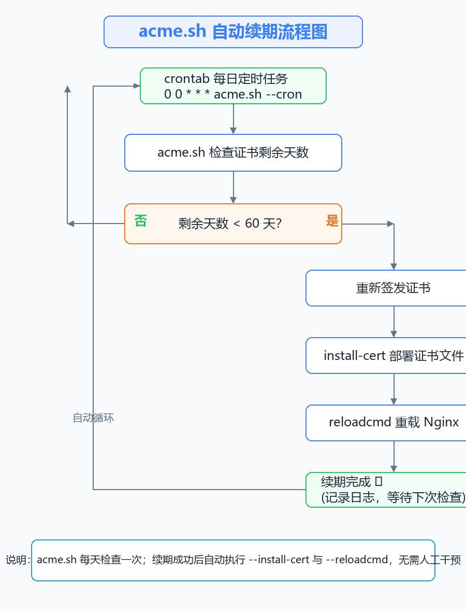
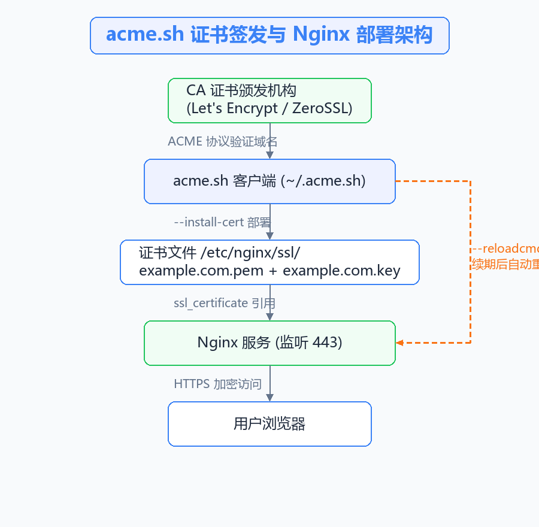

+++
date = '2026-08-03T15:30:00+08:00'
draft = false
title = 'acme.sh 自动续期教程：签发证书、部署到Nginx并自动重载'

categories = ['技术文章']
tags =  ["acme.sh", "HTTPS", "Nginx", "SSL证书"]

+++

### acme.sh 简介

HTTPS 证书通常有效期为 90 天（Let's Encrypt）或更长，手动续期不仅繁琐还容易漏掉，一旦证书过期，浏览器就会直接报安全错误。**acme.sh** 是一个纯 Shell 实现的 ACME 客户端，可以自动完成证书的申请、安装和续期，全程无需人工干预。

acme.sh 的主要特点：

- 纯 Shell 脚本，无任何依赖，安装即用
- 支持 Let's Encrypt、ZeroSSL、BuyPass 等多家 CA
- 支持 webroot、nginx、DNS 等多种验证方式，DNS 方式可签发泛域名证书
- 安装时自动注册 crontab 定时任务，每天检查证书有效期，剩余不足 60 天自动续期
- 续期成功后自动执行 `--reloadcmd` 指定的命令（如重载 Nginx），无需手动操作

整体流程如下：



### 安装 acme.sh

使用以下命令一键安装（安装到当前用户目录 `~/.acme.sh`）：

> curl https://get.acme.sh | sh

```bash
root@web-server:~# curl https://get.acme.sh | sh -s email=admin@example.com
  % Total    % Received % Xferd  Average Speed   Time    Time     Time  Current
                                 Dload  Upload   Total   Spent    Left  Speed
100  2268  100  2268    0     0   4978      0 --:--:-- --:--:-- --:--:--  4978
[2026-08-01 10:00:01] Installing from online archive.
[2026-08-01 10:00:02] Downloading https://github.com/acmesh-official/acme.sh/archive/master.tar.gz
[2026-08-01 10:00:05] Installing to /root/.acme.sh
[2026-08-01 10:00:06] Installed to /root/.acme.sh
[2026-08-01 10:00:06] Installing alias to '/root/.bashrc'
[2026-08-01 10:00:06] OK, Close and reopen your terminal to start using acme.sh
[2026-08-01 10:00:06] Installing cron job
[2026-08-01 10:00:07] Good, bash is found, so change the shebang to use bash as preferred.
[2026-08-01 10:00:08] Install success!
```

> 提示：`-s email=xxx` 为可选参数，指定注册邮箱。如果忘记指定，也可以稍后通过 `--register-account` 注册。

安装完成后可以查看帮助确认：

> ~/.acme.sh/acme.sh --help

### 注册 ACME 账号

使用默认 CA（ZeroSSL）前需要注册账号：

> ~/.acme.sh/acme.sh --register-account -m admin@example.com

```bash
root@web-server:~# ~/.acme.sh/acme.sh --register-account -m admin@example.com
[2026-08-01 10:05:00] Registering account
[2026-08-01 10:05:02] Registered
```

如果想使用 Let's Encrypt，可以切换默认 CA：

> ~/.acme.sh/acme.sh --set-default-ca --server letsencrypt

### 签发证书的三种方式

签发证书前需要选择域名验证方式，acme.sh 最常用的有三种：

| 方式 | 适用场景 | 是否需要开放端口 |
| ---- | ---- | ---- |
| `--webroot` | 已有网站目录（静态站点） | 80 端口 |
| `--nginx` | Nginx 已监听 80/443 | 80/443 端口 |
| `--dns` | 无外网访问、泛域名 | 不需要 |

#### 方式一：webroot 模式

适合网站根目录固定、可以写入验证文件的场景：

> ~/.acme.sh/acme.sh --issue -d example.com -w /var/www/html

```bash
root@web-server:~# ~/.acme.sh/acme.sh --issue -d example.com -w /var/www/html
[2026-08-01 10:10:00] Creating domain key
[2026-08-01 10:10:01] The domain key is here: /root/.acme.sh/example.com/example.com.key
[2026-08-01 10:10:02] Single domain='example.com'
[2026-08-01 10:10:03] Getting webroot for domain='example.com'
[2026-08-01 10:10:04] Verifying: example.com
[2026-08-01 10:10:06] Success
[2026-08-01 10:10:06] Your cert is in: /root/.acme.sh/example.com/example.com.cer
```

#### 方式二：nginx 模式

Nginx 已配置好 80/443 监听时，acme.sh 会自动修改 Nginx 配置完成验证再还原：

> ~/.acme.sh/acme.sh --issue -d example.com --nginx

#### 方式三：DNS 模式

适合泛域名（`*.example.com`）或无公网访问的服务器，以 Cloudflare 为例（需要先配置好 API Token）：

> export CF_Token="你的Cloudflare_API_Token"
> ~/.acme.sh/acme.sh --issue -d example.com -d "*.example.com" --dns dns_cf

> 提示：acme.sh 内置了几十种 DNS 服务商的 API 对接（dns_cf、dns_ali、dns_dp、dns_he 等），手动添加 TXT 记录也可以，但无法全自动续期，建议优先使用 API 方式。

### 安装证书到 Nginx

签发完成后，证书文件默认存放在 `~/.acme.sh/example.com/` 目录下，但**不建议**直接让 Nginx 引用该目录（升级或重新签发时目录结构可能变化），正确做法是使用 `--install-cert` 把证书复制到固定位置，并指定续期后要执行的命令：

> ~/.acme.sh/acme.sh --install-cert -d example.com \
> --key-file /etc/nginx/ssl/example.com.key \
> --fullchain-file /etc/nginx/ssl/example.com.pem \
> --reloadcmd "systemctl reload nginx"

```bash
root@web-server:~# mkdir -p /etc/nginx/ssl
root@web-server:~# ~/.acme.sh/acme.sh --install-cert -d example.com \
>   --key-file /etc/nginx/ssl/example.com.key \
>   --fullchain-file /etc/nginx/ssl/example.com.pem \
>   --reloadcmd "systemctl reload nginx"
[2026-08-01 10:15:00] Installing key to: /etc/nginx/ssl/example.com.key
[2026-08-01 10:15:00] Installing full chain to: /etc/nginx/ssl/example.com.pem
[2026-08-01 10:15:01] Run reload cmd: systemctl reload nginx
[2026-08-01 10:15:02] Reload success
```

> 参数说明：
> - `--key-file`：私钥文件路径
> - `--fullchain-file`：证书链完整文件路径（Nginx 推荐使用 fullchain）
> - `--reloadcmd`：续期成功并部署完成后自动执行的命令，这里是重载 Nginx

### Nginx HTTPS 配置

证书安装好后，修改 Nginx 配置开启 HTTPS：

> vim /etc/nginx/conf.d/example.com.conf

```nginx
server {
    listen 443 ssl;
    server_name example.com www.example.com;

    ssl_certificate     /etc/nginx/ssl/example.com.pem;
    ssl_certificate_key /etc/nginx/ssl/example.com.key;

    ssl_protocols TLSv1.2 TLSv1.3;
    ssl_ciphers HIGH:!aNULL:!MD5;

    location / {
        proxy_pass http://127.0.0.1:8080;  # 示例：反代到后端服务
        proxy_set_header Host $host;
        proxy_set_header X-Real-IP $remote_addr;
        proxy_set_header X-Forwarded-For $proxy_add_x_forwarded_for;
        proxy_set_header X-Forwarded-Proto $scheme;
    }
}

# HTTP 强制跳转 HTTPS
server {
    listen 80;
    server_name example.com www.example.com;
    return 301 https://$host$request_uri;
}
```

> 修改配置后务必先测试再重载：`nginx -t && nginx -s reload`

证书部署与访问的整体关系：



### 自动续期原理

acme.sh 安装时会自动注册一条 crontab 定时任务：

> crontab -l

```bash
root@web-server:~# crontab -l
# acme.sh 自动续期任务，每天凌晨 0 点执行
0 0 * * * "/root/.acme.sh"/acme.sh --cron --home "/root/.acme.sh" > /dev/null
```

每天定时检查所有证书的有效期：

- 剩余天数 **大于 60 天**：什么都不做，等待下次检查
- 剩余天数 **不足 60 天**：自动重新签发证书 → 执行 `--install-cert` 部署 → 执行 `--reloadcmd` 重载 Nginx

整个续期过程完全无人值守，这也是"自动续期"的核心。**只要证书文件路径不变、`reloadcmd` 配置正确，Nginx 会一直持有有效证书。**

### 验证与常用命令

1. 查看已签发的证书列表

> ~/.acme.sh/acme.sh --list

2. 查看证书到期时间

> openssl x509 -enddate -noout -in /etc/nginx/ssl/example.com.pem

```bash
root@web-server:~# openssl x509 -enddate -noout -in /etc/nginx/ssl/example.com.pem
notAfter=Oct 30 23:59:59 2026 GMT
```

3. 手动强制续期测试（验证整个自动流程是否正常）

> ~/.acme.sh/acme.sh --renew -d example.com --force

4. 查看 Nginx 是否已加载新证书

> nginx -T | grep -E "ssl_certificate|ssl_certificate_key"

### 常见问题与注意事项

- **证书目录权限**：`/etc/nginx/ssl/` 建议设置为仅 root 可读，私钥文件权限 `600`，证书文件 `644`，避免私钥泄露

- **reloadcmd 权限不足**：如果 `nginx -s reload` 报权限错误，改用 `systemctl reload nginx`；Nginx 跑在 Docker 里时使用 `docker exec nginx nginx -s reload`

- **Nginx 未监听 80 端口时**：webroot/nginx 模式都无法验证，此时只能用 DNS 模式

- **泛域名证书**：`*.example.com` 只能通过 DNS 模式签发，且不支持多级子域名（如 `a.b.example.com`）

- **默认 CA 是 ZeroSSL**：需要注册邮箱；不想用可以切回 Let's Encrypt（见上文 `--set-default-ca`）

- **升级 acme.sh**：`~/.acme.sh/acme.sh --upgrade`，升级不会影响已签发证书

- **服务器重启后证书失效？**：不会，证书文件是持久的，cron 任务也会随系统定时器继续执行

### 总结

acme.sh 的核心价值在于**一次配置、永久省心**：签发 → 安装 → 自动续期 → 自动重载 Nginx，整个闭环完全自动化。配合 `--install-cert` 的固定路径部署和 `--reloadcmd`，可以彻底告别"证书过期网站打不开"的尴尬。

建议所有自建 HTTPS 服务（Nginx、Tomcat、Caddy 等）都纳入 acme.sh 统一管理，运维幸福感直接拉满。
