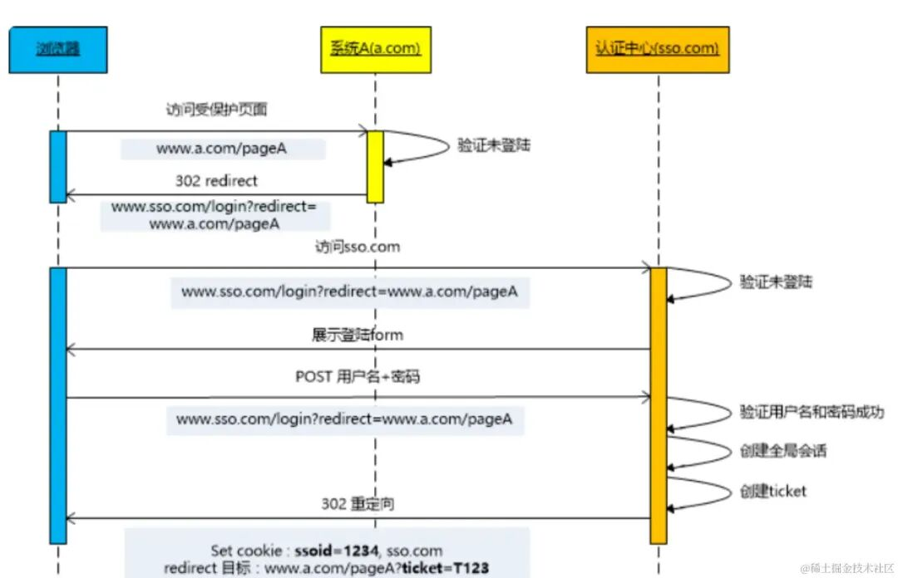
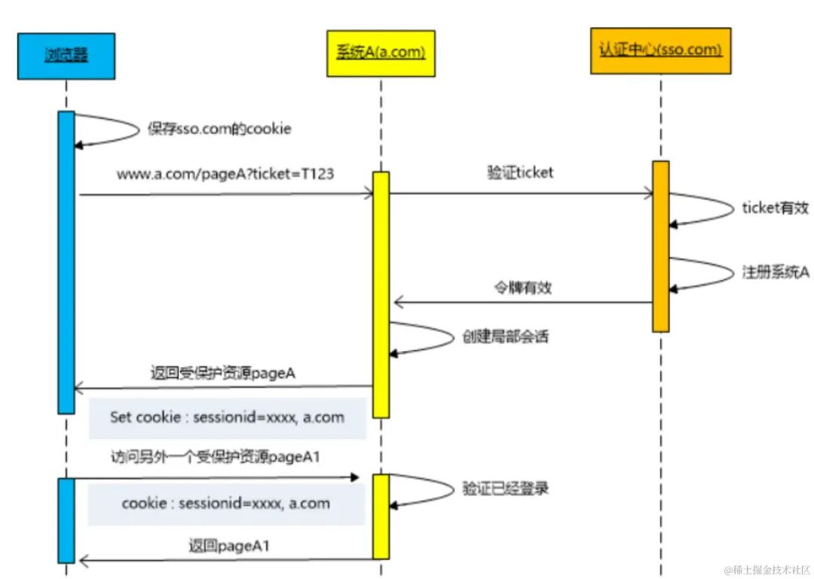
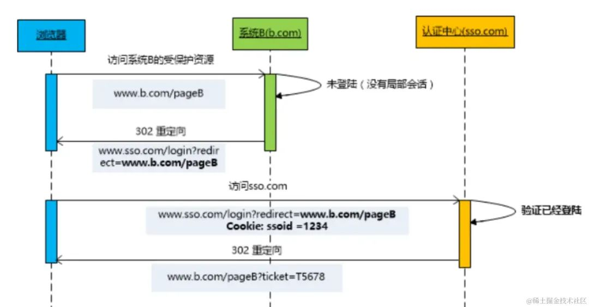

+++
date = '2025-09-12T13:16:35+08:00'
draft = false
title = '单点登录SSO实现原理'
categories = ['技术文章']
tags =  ["Java", "SpringBoot"]
+++

### SSO 机制实现流程

用户首次访问时，需要在认证中心登录：



1. 用户访问网站 a.com 下的 pageA 页面。
2. 由于没有登录，则会重定向到认证中心，并带上回调地址 （http://www.sso.com?return_uri=a.com/pageA%EF%BC%8C%E4%BB%A5%E4%BE%BF%E7%99%BB%E5%BD%95%E5%90%8E%E7%9B%B4%E6%8E%A5%E8%BF%9B%E5%85%A5%E5%AF%B9%E5%BA%94%E9%A1%B5%E9%9D%A2%E3%80%82 ）
3. 用户在认证中心输入账号密码，提交登录。
4. 认证中心验证账号密码有效，然后重定向 a.com?ticket=123 带上授权码 ticket，并将认证中心 sso.com 的登录态写入 Cookie。
5. 在 a.com 服务器中，拿着 ticket 向认证中心确认，授权码 ticket 真实有效。
6. 验证成功后，服务器将登录信息写入 Cookie（此时客户端有 2 个 Cookie 分别存有 a.com 和 sso.com 的登录台）。

认证中心登录完成之后，继续访问 `a.com` 下的其他页面：



这个时候，由于 `a.com` 存在已登录的 `Cookie` 信息，所以服务器端直接认证成功。

如果认证中心登录完成之后，访问 `b.com` 下的页面：



这个时候，由于认证中心存在之前登录过的 `Cookie`，所以也不用再次输入账号密码，直接返回第 4 步，下发 `ticket` 给 `b.com` 即可。

### 疑问

> 疑问：我在访问b.com时，浏览器携带了什么参数，认证中心才知道是否已经登录。其次，浏览器怎么知道我访问b.com时要关联a.com的登录信息，怎么建立关联的

### 解答

我帮你把这个 SSO（单点登录）场景拆开解释一下，你的两个疑问其实分别对应 **浏览器和 Cookie 的作用** 以及 **不同站点之间的关联机制**。

 1️⃣ 访问 b.com  时，浏览器携带了什么让认证中心知道你已登录？

当你访问 b.com  时，如果 b.com  发现自己没有本地登录态（自己的 Cookie），它会重定向你去认证中心（sso.com），并带上回调地址，例如：

Code

```
https://sso.com/login?return_uri=https://b.com/pageB
```

这时浏览器会向 **sso.com** 发起请求。 关键点是：**浏览器会自动携带 sso.com  域下的 Cookie**（如果之前在 sso.com  登录时已经种下了，并且还没过期）。

- 这个 Cookie 是认证中心在你第一次登录（访问 a.com  时）写入的，比如：

  Code

  ```
  Set-Cookie: sso_session=abc123; Domain=sso.com; Path=/; HttpOnly; Secure
  ```

- 因为 sso.com  是同一个域名，不管是从 a.com  跳过去还是从 b.com  跳过去，浏览器都会带上这个 Cookie。

- 认证中心收到请求后，通过这个 Cookie 就能查到你已经有有效的登录会话，于是直接生成一个新的 ticket 给 b.com，而不需要你再次输入账号密码。

✅ **所以答案是**：浏览器携带的是 **sso.com  域的 Cookie**（例如 `sso_session`），认证中心用它来判断你是否已登录。

2️⃣ 浏览器怎么知道访问 b.com  时要关联 a.com  的登录信息？

其实浏览器**并不知道** a.com  和 b.com  的登录信息要关联，它只是遵循 HTTP/Cookie 的规则：

- **a.com  的 Cookie** 只能被 a.com  访问，**b.com  的 Cookie** 只能被 b.com  访问，浏览器不会跨域共享它们。
- 关联的“桥梁”是 **sso.com**：
  - a.com  登录时，sso.com 域下的 Cookie 被写入。
  - b.com  登录时，也会去访问 sso.com，浏览器会带上同一个 sso.com  的 Cookie。
  - 认证中心（sso.com）通过这个 Cookie 知道你是谁，然后给 b.com  发一个新的 ticket。
- 这样，虽然 a.com  和 b.com  的 Cookie 互相不可见，但它们都信任 sso.com  发的 ticket，于是就间接建立了关联。

🔄 流程图（简化版）

```
[浏览器访问 b.com]
   ↓
b.com 发现没登录 → 跳转到 sso.com?return_uri=b.com
   ↓
浏览器访问 sso.com（自动带上 sso.com 的 Cookie）
   ↓
sso.com 发现 Cookie 有效 → 生成 ticket → 重定向回 b.com?ticket=xxx
   ↓
b.com 用 ticket 向 sso.com 验证 → 登录成功 → 写入 b.com 自己的 Cookie
```

📌 总结

- **访问 b.com  时，浏览器带的是 sso.com  域的 Cookie**，认证中心用它判断是否已登录。
- **a.com  和 b.com  的登录信息关联是通过 sso.com  作为中介实现的**，浏览器本身并不直接共享它们的 Cookie。
