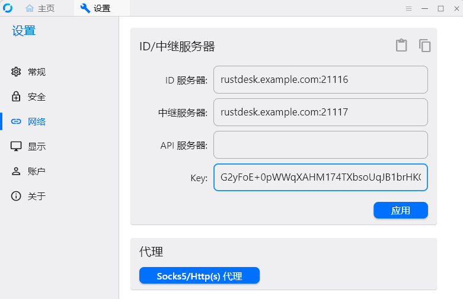
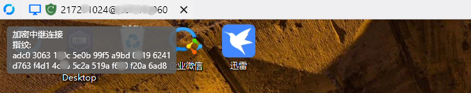
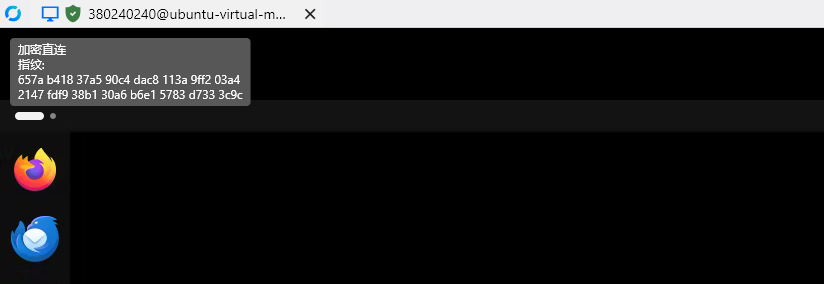

+++
date = '2025-10-21T10:32:49+08:00'
draft = false
title = '通过DockerCompose自建rustdesk服务'

categories = ['技术文章']
tags =  ["远程工具", "rustdesk"]

+++

### rustdesk简介

RustDesk 是一款可以平替TeamViewer的开源软件，旨在提供安全便捷的自建方案。

### 部署rustdesk-server

rustdesk支持自行搭建属于你的RustDesk服务器，所有的一切都是免费且开源的。所谓自建服务器，也就是自建 ID Server 和 Relay Server。

服务器端口开放说明：

- 开放TCP端口 `21115` 、 `21116` 、 `21117` 、 `21118（可选）` 、 `21119（可选）`

- 开放UDP端口 `21116`

> 服务器端口作用：https://rustdesk.com/docs/zh-cn/self-host/rustdesk-server-oss/docker/


#### 部署rustdesk-server

创建部署目录

```bash
mkdir -p /data/rustdesk/compose
cd /data/rustdesk/compose
```

创建docker-compose文件

> vim docker-compose.yaml

```yaml
root@rustdesk-server:/data/rustdesk/compose# vim docker-compose.yaml 
services:
  hbbs:
    container_name: hbbs
    image: rustdesk/rustdesk-server:1.1.11
    command: hbbs
    environment:
      - "RELAY=hbbr:21117"
      - "ENCRYPTED_ONLY=1"
    ports:
      - 21115:21115
      - 21116:21116
      - 21116:21116/udp
      - 21118:21118
    volumes:
      - /data/rustdesk/root:/root
    networks:
      - rustdesk-net
    depends_on:
      - hbbr
    restart: unless-stopped

  hbbr:
    container_name: hbbr
    image: rustdesk/rustdesk-server:1.1.11
    command: hbbr
    ports:
      - 21117:21117
      - 21119:21119
    volumes:
      - /data/rustdesk/root:/root
    networks:
      - rustdesk-net
    restart: unless-stopped

networks:
  rustdesk-net:
    external: false
```

主要参数说明：

- 环境变量 `RELAY` ：指定hbbr 服务的地址和端口，由于使用同一个docker network，可以通过容器名称 `hbbr` 连接

- 环境变量 `ENCRYPTED_ONLY` ：启用加密连接并使用key验证，防止其他获取地址的客户端非法连接

执行以下命令运行容器

> docker compose up -d

```bash
root@rustdesk-server:/data/rustdesk/compose# docker compose up -d
[+] Building 0.0s (0/0)                                                                                                                                                                   docker:default
[+] Running 3/3
 ✔ Network compose_rustdesk-net  Created                                                                                                                                                            0.1s 
 ✔ Container hbbr                Started                                                                                                                                                            0.1s 
 ✔ Container hbbs                Started    
```

查看运行的两个容器 `hbbr` 和 `hbbs` 

> docker compose ps

```bash
root@rustdesk-server:/data/rustdesk/compose# docker compose ps
NAME         IMAGE                                   COMMAND                  SERVICE      CREATED          STATUS          PORTS
hbbr         rustdesk/rustdesk-server:1.1.11         "hbbr"                   hbbr         44 seconds ago   Up 43 seconds   0.0.0.0:21117->21117/tcp, :::21117->21117/tcp, 0.0.0.0:21119->21119/tcp, :::21119->21119/tcp
hbbs         rustdesk/rustdesk-server:1.1.11         "hbbs"                   hbbs         44 seconds ago   Up 42 seconds   0.0.0.0:21115-21116->21115-21116/tcp, :::21115-21116->21115-21116/tcp, 0.0.0.0:21118->21118/tcp, :::21118->21118/tcp, 0.0.0.0:21116->21116/udp, :::21116->21116/udp
root@rustdesk-server:/data/rustdesk/compose# 
```

查看主机当前目录结构

> cd /data/rustdesk/

```bash
/data/rustdesk/
├── compose
│   └── docker-compose.yaml
└── root
    ├── db_v2.sqlite3
    ├── db_v2.sqlite3-shm
    ├── db_v2.sqlite3-wal
    ├── id_ed25519
    └── id_ed25519.pub

2 directories, 6 files
root@rustdesk-server:~# 
```

#### 连接验证

服务端搭建好后，在要连接的两个客户端设备上都下载 RustDesk 客户端。

下载地址是： [https://github.com/rustdesk/rustdesk/releases](https://github.com/rustdesk/rustdesk/releases) 

在rustdesk-server上获取默认生成的公钥key

```bash
root@rustdesk-server:~# cat /data/rustdesk/root/id_ed25519.pub 
G2yFoE+0pWWqXAHM174TXbsoUqJB1brHKOxZhEKv7hA=
```

首先找到 RustDesk 客户端的 `设置` -> `ID/中继服务器` ，然后输入如下三个信息

- ID 服务器： `rustdesk.example.com:21116` ，默认端口为 `21116` 时可以省略端口配置

- 中继服务器： `rustdesk.example.com:21117` ，默认端口为 `21117` 时可以省略端口配置

- Key：填写部署服务默认生成的 `id_ed25519.pub` 文件中的内容

示例配置如下：
 

所有客户端必须都完成相应配置，配置完成后连接测试：

**1、中继连接测试** 

连接成功后鼠标指针放在左上角绿色图标处，显示通过加密中继连接，说明两台机器位于不同网络，无法通过P2P直连，要经过阿里云rustdesk-server中继连接。
 

**2、直连连接测试** 

如果位于同一网络的两台客户端互联，由于中间不存在NAT设备和防火墙，将显示两台客户端为加密直连，无需经过中继：
 

